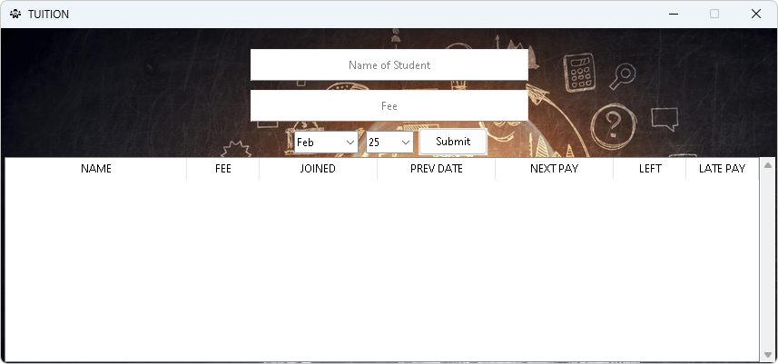

# TUITION

**A python script that lets you:**

## [Store]

- Fee.
- Name of students.
- Date when the student joined.
- Date when you got the last payment.

## [Calculate]

- Next date of payment.
- Number of days left for next payment.
- Number of days when you get late payment.

## [Remove]

To remove some values you need to provide:

- Name of the student.
- Amount of fee of that student.
- Month and date when that student joined.
